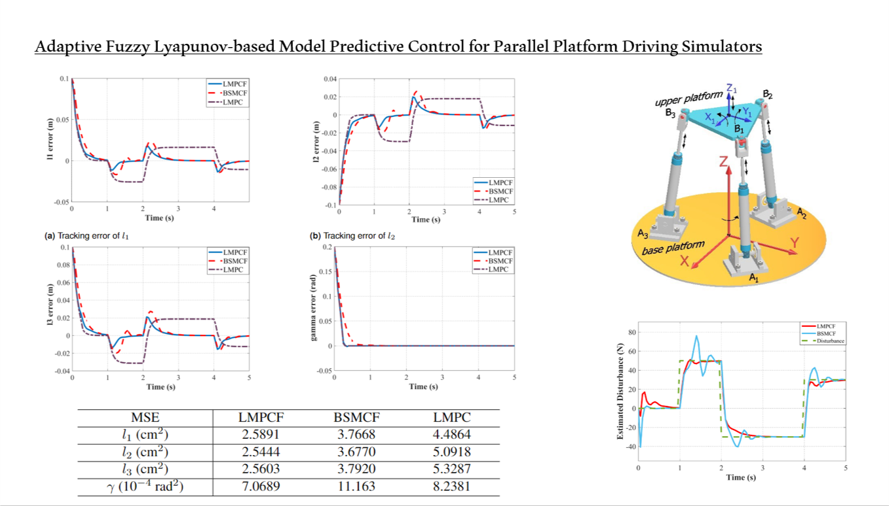

# Parallel_robot_fuzzy_mpc_matlab

## Introduction 

This resource includes all necessary MATLAB files for the simulation of a car simulator under the control of Adaptive Lyapunov-based Model Predictive Control controller, Adaptive Backstepping controller, and Lyapunov-based Model Predictive Control controller, which is presented in our paper ["Adaptive fuzzy Lyapunov-based model predictive control for parallel platform driving simulators"](https://doi.org/10.1177/01423312221122470)

## Contributions
1. The proposed method is able to cope with the problem of controller design for the CDS considering the input and system constraints which are typically neglected
in many studies, especially conventional nonlinear controllers. By employing the MPC, all the constraints are explicitly expressed and solved in the optimizing process, leading to improved performance and the robustness of the tracking problem for the CDS.
2. The proposed controller also has an ability to deal with the stability problem of traditional nonlinear MPC, leading to the system’s stability being explicitly
analyzed, owning a stable feedback controller and its corresponding Lyapunov function, and thus the sufficient conditions to guarantee the recursive feasibility
and closed-loop stability for MPC problems are explicitly derived.
3. The fuzzy logic system is designed accompanied by an adaptive updated law for the Lyapunov-based MPC, which can approximate the unknown external disturbances and uncertain parameters to enhance predictive quality.

## Results


## Citation
If you find this reference implementation useful in your research, please consider citing:
```
@article{manh2021adaptive,
  title={Adaptive Fuzzy Lyapunov-based Model Predictive Control for Parallel Platform Driving Simulators},
  author={Manh, Cuong Nguyen and Nguyen, Nhu Toan and Duy, Nam Bui and Lam, Tung},
  year={2021}
}
```
